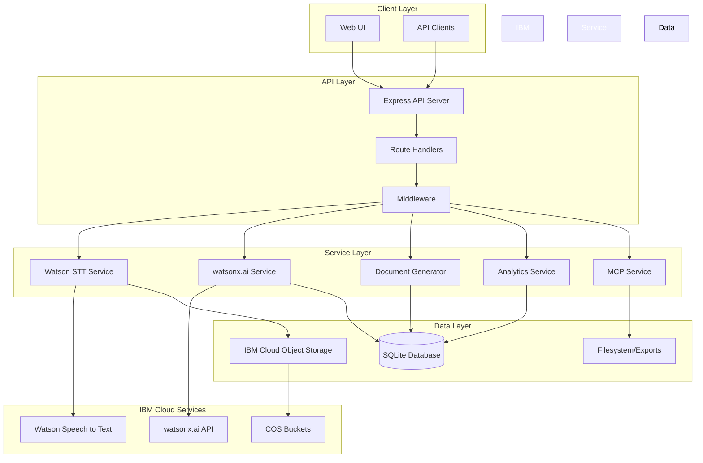
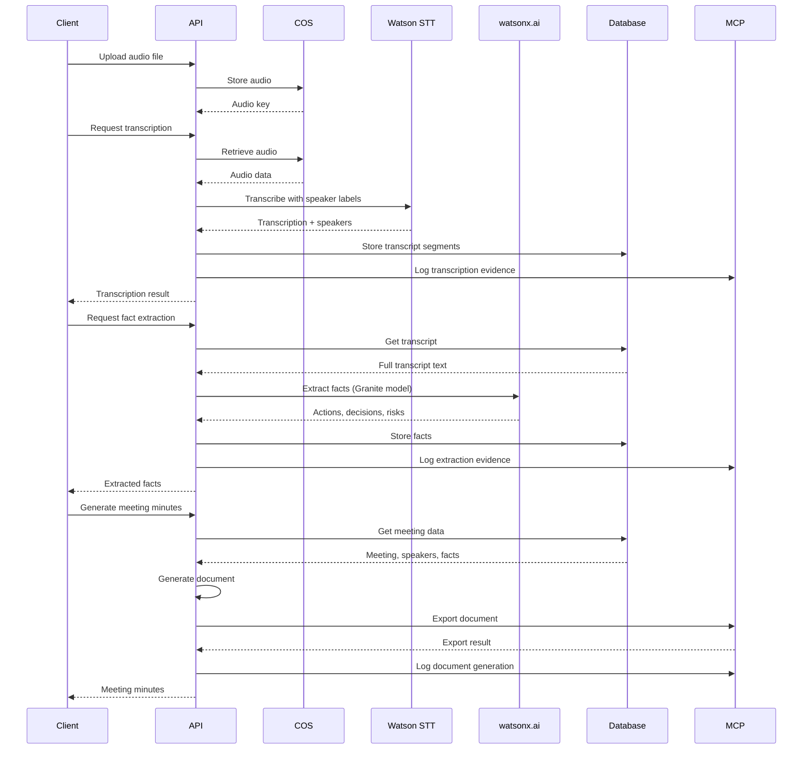
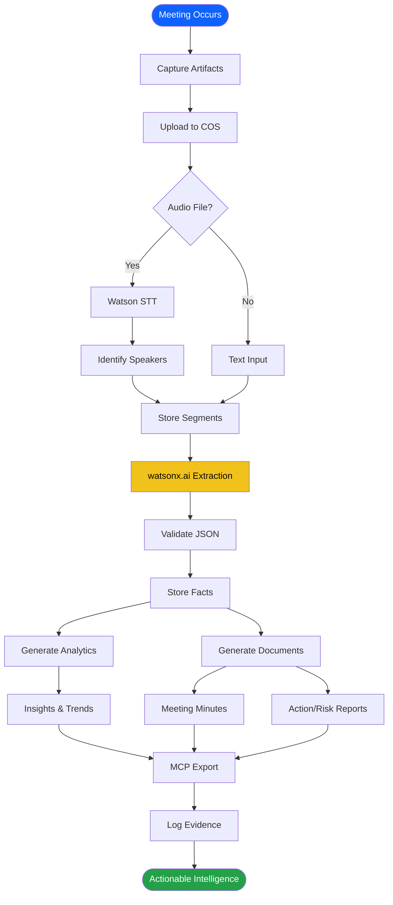
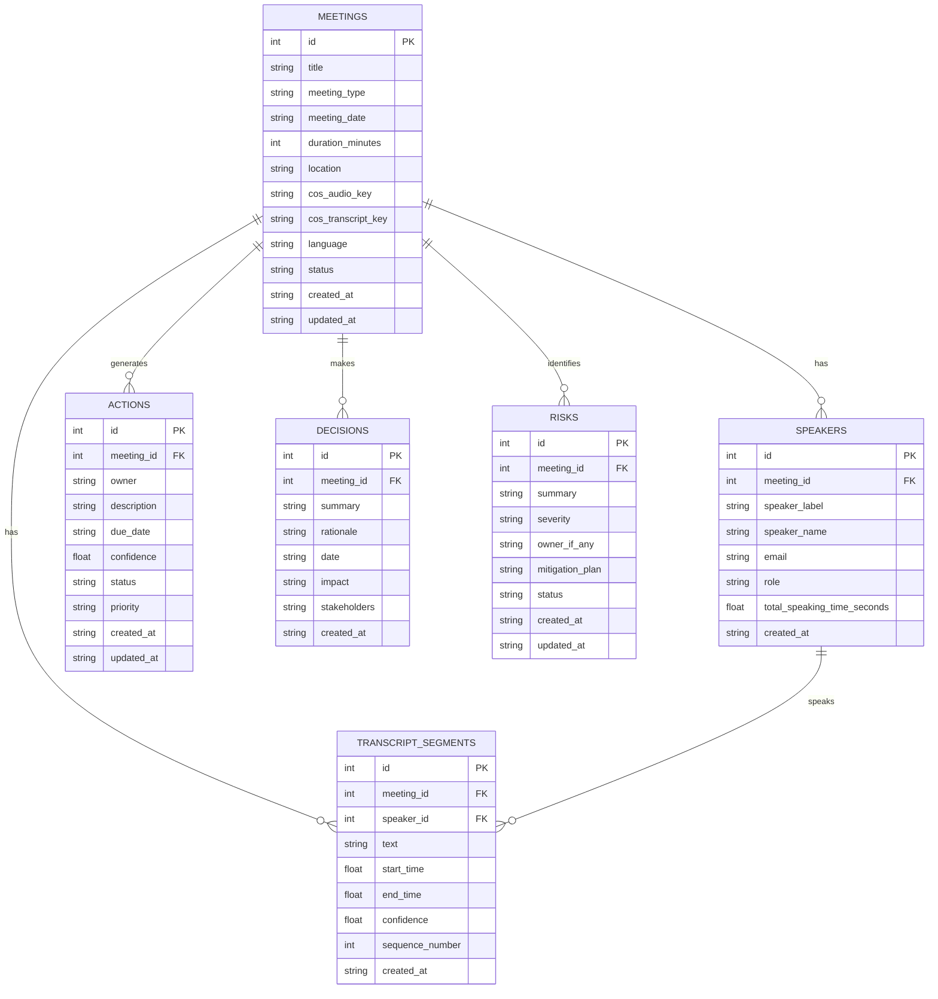

# Meeting Memory Intelligence Engine - Architecture Documentation

**Version:** 1.0.0  
**Date:** 2026-02-03  
**Status:** Production Ready

## Table of Contents

1. [System Overview](#system-overview)
2. [Architecture Diagrams](#architecture-diagrams)
3. [Component Details](#component-details)
4. [Data Flow](#data-flow)
5. [API Architecture](#api-architecture)
6. [Database Schema](#database-schema)
7. [Integration Points](#integration-points)
8. [Security Architecture](#security-architecture)
9. [Deployment Architecture](#deployment-architecture)
10. [Scalability Considerations](#scalability-considerations)

---

## System Overview

The Meeting Memory Intelligence Engine is a comprehensive platform that transforms meeting artifacts (audio, transcripts, notes) into actionable intelligence through AI-powered extraction, analytics, and automated documentation.

### Key Capabilities

- **Audio Transcription**: Watson Speech to Text with speaker identification
- **Fact Extraction**: watsonx.ai Granite models for actions, decisions, risks
- **Document Generation**: Automated meeting minutes, reports, summaries
- **Analytics**: Trend detection, predictive insights, team metrics
- **Evidence Capture**: MCP filesystem integration for audit trails
- **Cross-Meeting Intelligence**: Timeline views, workload analysis, risk tracking

### Technology Stack

- **Runtime**: Node.js v24 with TypeScript
- **Framework**: Express.js with ES modules
- **Database**: SQLite (production: IBM Db2)
- **Storage**: IBM Cloud Object Storage (S3-compatible)
- **AI/ML**: IBM watsonx.ai, Watson Speech to Text
- **Validation**: Zod schemas
- **Testing**: Jest
- **Deployment**: Docker, IBM Cloud Code Engine

---

## Architecture Diagrams

### High-Level System Architecture



### Request Flow Architecture



### Component Architecture

```mermaid
graph LR
    subgraph "Routes Layer"
        R1[/ingest]
        R2[/transcribe]
        R3[/process]
        R4[/meetings]
        R5[/documents]
        R6[/analytics]
        R7[/mcp]
    end
    
    subgraph "Services Layer"
        S1[COS Service]
        S2[STT Service]
        S3[watsonx Service]
        S4[NLP Service]
        S5[DocGen Service]
        S6[Analytics Service]
        S7[MCP Service]
    end
    
    subgraph "Data Layer"
        D1[Repository]
        D2[Validators]
    end
    
    R1 --> S1
    R2 --> S2
    R2 --> S1
    R3 --> S3
    R3 --> S4
    R4 --> D1
    R5 --> S5
    R5 --> D1
    R6 --> S6
    R6 --> D1
    R7 --> S7
    
    S2 --> S1
    S3 --> D2
    S5 --> D1
    S6 --> D1
    
    D1 --> DB[(Database)]
    S1 --> COS[(COS)]
    S7 --> FS[(Filesystem)]
    
    style Routes Layer fill:#0f62fe,color:#fff
    style Services Layer fill:#24a148,color:#fff
    style Data Layer fill:#f1c21b,color:#000
```

### Data Flow Diagram



---

## Component Details

### 1. API Server (`api/src/index.ts`)

**Responsibilities:**
- HTTP server initialization
- Route registration
- Middleware configuration
- Database initialization
- MCP directory setup
- Error handling
- Graceful shutdown

**Key Features:**
- CORS enabled
- JSON body parsing (20MB limit)
- Request logging
- Global error handler
- Health check endpoint
- Static file serving

### 2. Route Handlers

#### Ingest Route (`/ingest`)
- File upload handling (multer)
- COS upload
- MIME type validation
- Size limits

#### Transcribe Route (`/transcribe`)
- Audio transcription
- Speaker identification
- Language support (10 languages)
- Format validation (8 formats)

#### Process Route (`/process`)
- Fact extraction
- watsonx.ai integration
- JSON validation
- Confidence scoring

#### Meetings Route (`/meetings`)
- CRUD operations
- Speaker management
- Transcript retrieval
- Statistics

#### Documents Route (`/documents`)
- Meeting minutes generation
- Action/risk reports
- Executive summaries
- Multiple formats (MD, HTML, TXT)

#### Analytics Route (`/analytics`)
- Trend analysis
- Team metrics
- Predictive insights
- Dashboard data
- Chart-ready formats

#### MCP Route (`/mcp`)
- Export operations
- Evidence logging
- File management
- Usage reporting

### 3. Services

#### COS Service (`api/src/services/cos.ts`)
- S3-compatible operations
- Upload/download/list/delete
- Metadata handling
- Error handling with retries

#### STT Service (`api/src/services/stt.ts`)
- Watson Speech to Text integration
- Speaker diarization
- Multi-language support
- Confidence scoring
- Structured output

#### watsonx Service (`api/src/services/wx.ts`)
- Granite model integration
- Prompt engineering
- Retry logic (3 attempts)
- Fallback strategies
- Connection testing

#### NLP Service (`api/src/services/nlp.ts`)
- Prompt templates
- Meeting type detection
- Context building
- JSON enforcement

#### Document Generation Service (`api/src/services/docgen.ts`)
- Meeting minutes (MD/HTML/TXT)
- Action reports
- Risk reports
- Executive summaries
- Template system

#### Analytics Service (`api/src/services/analytics.ts`)
- Trend detection
- Pattern analysis
- Predictive insights
- Team metrics
- Meeting effectiveness

#### MCP Service (`api/src/services/mcp.ts`)
- Filesystem operations
- Evidence logging (JSONL)
- Export management
- Audit trails
- Usage reporting

### 4. Database Repository (`api/src/db/repo.ts`)

**Tables:**
- `meetings`: Core meeting metadata
- `speakers`: Participant tracking
- `transcript_segments`: Detailed transcription
- `actions`: Action items with status
- `decisions`: Decision logs
- `risks`: Risk tracking

**Operations:**
- CRUD for all entities
- Analytics queries
- Workload analysis
- Statistics generation

### 5. Validators (`api/src/utils/validators.ts`)

**Functions:**
- `parseFactsJson()`: 4-stage JSON parsing
- `sanitizeFacts()`: Data cleaning
- `assessExtractionQuality()`: Confidence scoring

**Strategies:**
1. Try JSON with code fences
2. Extract JSON blocks
3. Clean and retry
4. Fix common issues

---

## Data Flow

### 1. Audio Processing Flow

```
Audio Upload → COS Storage → Watson STT → Speaker Identification → 
Transcript Segments → Database Storage → MCP Evidence Log
```

### 2. Fact Extraction Flow

```
Transcript Text → watsonx.ai (Granite) → JSON Response → 
Validation (4-stage) → Sanitization → Database Storage → 
MCP Evidence Log
```

### 3. Document Generation Flow

```
Meeting ID → Database Query (meeting, speakers, facts) → 
Template Selection → Content Generation → Format Conversion → 
MCP Export → Evidence Log
```

### 4. Analytics Flow

```
Database Query → Time-based Grouping → Trend Calculation → 
Change Detection → Insight Generation → Chart Formatting → 
API Response
```

---

## API Architecture

### RESTful Design Principles

- Resource-based URLs
- HTTP methods (GET, POST, PUT, DELETE)
- Status codes (200, 201, 400, 404, 500)
- JSON request/response
- Pagination support
- Query parameters for filtering

### Endpoint Categories

**Data Ingestion:**
- POST /ingest
- POST /transcribe

**Data Processing:**
- POST /process

**Data Management:**
- CRUD /meetings/*
- GET /meetings/:id/speakers
- GET /meetings/:id/transcript

**Document Generation:**
- POST /documents/minutes
- GET /documents/minutes/:id
- POST /documents/action-report
- GET /documents/risk-report
- POST /documents/executive-summary

**Analytics:**
- GET /analytics/summary
- GET /analytics/actions/trends
- GET /analytics/team/metrics
- GET /analytics/insights/predictive
- GET /analytics/dashboard

**MCP Operations:**
- GET /mcp/status
- POST /mcp/export
- GET /mcp/exports
- GET /mcp/evidence
- GET /mcp/report

### Error Handling Strategy

```typescript
{
  success: false,
  error: "Human-readable message",
  code: "ERROR_CODE",
  details: { /* Additional context */ }
}
```

---

## Database Schema

### Entity Relationship Diagram



### Indexes

- `idx_meetings_date`: Fast date-based queries
- `idx_meetings_type`: Filter by meeting type
- `idx_meetings_status`: Filter by status
- `idx_speakers_meeting`: Speaker lookups
- `idx_transcript_meeting`: Transcript retrieval
- `idx_actions_meeting`: Actions by meeting
- `idx_actions_owner`: Owner workload queries
- `idx_actions_status`: Status filtering
- `idx_risks_severity`: High-severity queries

---

## Integration Points

### IBM Watson Speech to Text

**Configuration:**
```typescript
{
  apikey: process.env.WATSON_STT_APIKEY,
  serviceUrl: process.env.WATSON_STT_URL,
  version: '2023-03-01'
}
```

**Features Used:**
- Speaker labels (diarization)
- Timestamps
- Confidence scores
- Multi-language support

### IBM watsonx.ai

**Configuration:**
```typescript
{
  apikey: process.env.WATSONX_API_KEY,
  projectId: process.env.WATSONX_PROJECT_ID,
  serviceUrl: process.env.WATSONX_URL,
  version: '2024-03-19'
}
```

**Model:** `ibm/granite-3-8b-instruct`

**Parameters:**
- max_new_tokens: 800
- temperature: 0.2
- top_p: 0.95

### IBM Cloud Object Storage

**Configuration:**
```typescript
{
  endpoint: process.env.COS_ENDPOINT,
  apiKeyId: process.env.COS_API_KEY,
  serviceInstanceId: process.env.COS_INSTANCE_CRN
}
```

**Operations:**
- Upload (putObject)
- Download (getObject)
- List (listObjectsV2)
- Delete (deleteObject)

---

## Security Architecture

### Authentication & Authorization

**Current:** API key-based (development)
**Future:** IBM Cloud IAM, OAuth 2.0

### Data Protection

**In Transit:**
- HTTPS/TLS 1.3
- Encrypted API calls to IBM services

**At Rest:**
- COS encryption
- Database encryption (production)

### Input Validation

- Zod schemas for all inputs
- MIME type validation
- File size limits
- SQL injection prevention (parameterized queries)
- XSS prevention (output encoding)

### Secrets Management

- Environment variables (.env)
- No secrets in code
- .gitignore for sensitive files
- Log redaction

### Rate Limiting

**Future Implementation:**
- Per-IP rate limiting
- Per-user quotas
- Burst protection

---

## Deployment Architecture

### Docker Container

```dockerfile
FROM node:24-alpine
WORKDIR /app
COPY package*.json ./
RUN npm ci --production
COPY . .
EXPOSE 8080
CMD ["npm", "start"]
```

### IBM Cloud Code Engine

**Configuration:**
- Min instances: 0 (scale to zero)
- Max instances: 10
- CPU: 1 vCPU
- Memory: 2 GB
- Concurrency: 100
- Timeout: 300s

**Environment Variables:**
- COS credentials
- Watson STT credentials
- watsonx.ai credentials
- Database connection

### Health Checks

**Endpoint:** GET /health

**Response:**
```json
{
  "ok": true,
  "timestamp": "2026-02-03T05:10:11.140Z",
  "env": "production",
  "version": "1.0.0"
}
```

---

## Scalability Considerations

### Horizontal Scaling

- Stateless API design
- Session-less architecture
- Load balancer compatible
- Database connection pooling

### Vertical Scaling

- Configurable memory limits
- CPU optimization
- Efficient database queries
- Caching strategies (future)

### Performance Optimization

**Current:**
- Database indexes
- Efficient queries
- Streaming responses
- Retry logic with backoff

**Future:**
- Redis caching
- CDN for static assets
- Database read replicas
- Async job processing

### Monitoring & Observability

**Current:**
- Console logging (Pino)
- Health check endpoint
- MCP evidence logging

**Future:**
- IBM Cloud Monitoring
- Log Analysis
- Distributed tracing
- Performance metrics
- Alert management

---

## Conclusion

The Meeting Memory Intelligence Engine is built on a modern, scalable architecture leveraging IBM Cloud services for AI/ML capabilities, storage, and deployment. The modular design allows for easy extension and maintenance while providing comprehensive meeting intelligence capabilities.

**Key Architectural Strengths:**
- ✅ Modular service-oriented design
- ✅ RESTful API architecture
- ✅ Comprehensive error handling
- ✅ Evidence-based audit trails
- ✅ Scalable deployment model
- ✅ IBM Cloud native integration
- ✅ Type-safe TypeScript implementation
- ✅ Extensible plugin architecture

**Production Readiness:**
- ✅ Docker containerization
- ✅ Health check endpoints
- ✅ Graceful shutdown
- ✅ Environment-based configuration
- ✅ Comprehensive logging
- ✅ Error recovery mechanisms