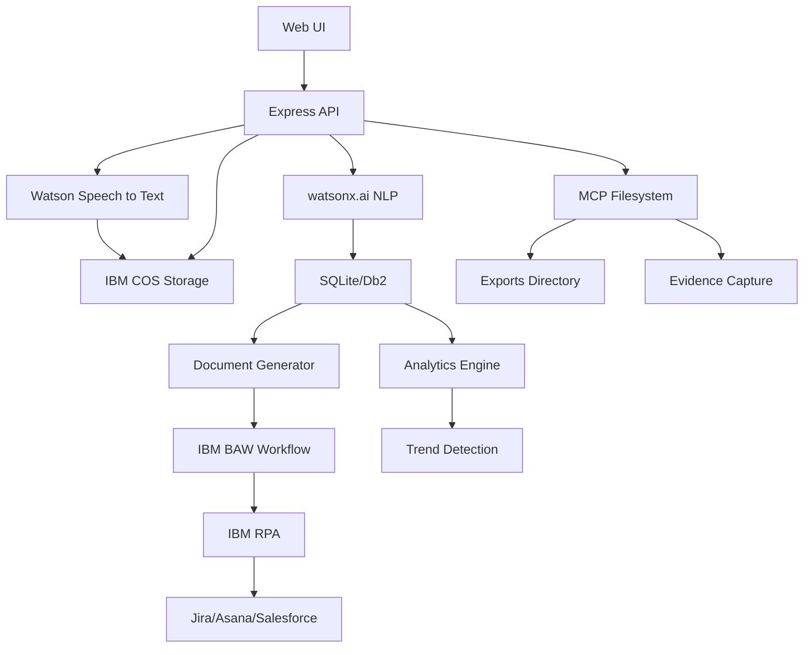

# Meeting Memory Intelligence Engine - Implementation Plan

**Created:** 2026-02-02T07:24:00Z  
**Status:** Planning Phase  
**Objective:** Build an automated meeting intelligence system that captures, processes, and documents client meetings using IBM automation services.

---

## Executive Summary

Transform the current MVP (text-based transcript processing) into a comprehensive meeting automation platform that:
- Transcribes audio using Watson Speech to Text
- Extracts insights using watsonx.ai
- Generates professional documents automatically
- Routes tasks to project management systems via RPA
- Provides analytics and trend detection across meetings

---

## Current State Analysis

### ✅ Implemented (MVP)
- Express API with TypeScript
- IBM Cloud Object Storage (COS) integration for file uploads
- watsonx.ai integration for text extraction
- SQLite database for storing actions, decisions, and risks
- Basic web UI for upload and processing
- CSV/JSON export functionality
- Zod validation for extracted facts

### ❌ Missing Components
- Watson Speech to Text integration
- Audio file handling and transcription
- Speaker identification
- IBM Business Automation Workflow integration
- IBM RPA integration for external system push
- Automated document generation (PDF/Word)
- Analytics and trend detection
- Workflow tracking and reminders
- Enhanced error handling and logging
- Comprehensive test coverage
- MCP filesystem integration
- Production-ready deployment configuration

---

## Architecture Evolution

### Phase 1: Current MVP Architecture
```
Web UI → Express API → COS (text uploads)
                    → watsonx.ai (extraction)
                    → SQLite (facts storage)
                    → CSV/JSON exports
```

### Phase 2: Target Architecture
```
Web UI → Express API → Watson STT (audio → text)
                    → COS (audio + text storage)
                    → watsonx.ai (extraction + analytics)
                    → SQLite/Db2 (facts + metadata)
                    → Document Generator (PDF/Word)
                    → IBM BAW (workflow routing)
                    → IBM RPA (external system push)
                    → MCP Filesystem (exports + evidence)
```

### Mermaid Architecture Diagram


---

## Implementation Phases

### Phase 1: Core Enhancements (Days 1-2)

#### 1.1 Watson Speech to Text Integration
**Priority:** HIGH  
**Effort:** 4-6 hours

**Tasks:**
- Add Watson STT SDK to dependencies
- Create `api/src/services/stt.ts` service
- Implement audio file upload handling (WAV, MP3, M4A)
- Add speaker identification support
- Support multiple languages (en-US, es-ES, etc.)
- Create `/transcribe` endpoint

**Files to Create/Modify:**
- `api/src/services/stt.ts` (new)
- `api/src/routes/transcribe.ts` (new)
- `api/.env.example` (add STT credentials)
- `api/package.json` (add @ibm-watson/speech-to-text)

**Environment Variables:**
```env
WATSON_STT_APIKEY=<apikey>
WATSON_STT_URL=https://<region>.speech-to-text.watson.cloud.ibm.com
WATSON_STT_INSTANCE_ID=<instance-id>
```

#### 1.2 Enhanced watsonx.ai Prompts
**Priority:** HIGH  
**Effort:** 2-3 hours

**Tasks:**
- Implement v2 prompt with strict JSON enforcement
- Add temperature and token parameter tuning
- Create prompt templates for different meeting types
- Add confidence scoring improvements
- Implement retry logic for failed extractions

**Files to Modify:**
- `api/src/services/nlp.ts`
- `api/src/services/wx.ts`

**New Prompt Template:**
```typescript
export const FACTS_PROMPT_V2 = `
You are an operations analyst. From the FULL TRANSCRIPT, extract:
- ACTIONS: {owner, description, due_date (ISO if present), confidence 0..1}
- DECISIONS: {summary, rationale, date (ISO if present)}
- RISKS: {summary, severity(low|med|high), owner_if_any}

CRITICAL: Output must be valid JSON, no prose, no code fences, no commentary.
Return ONLY a JSON object with keys: actions, decisions, risks.
`;
```

#### 1.3 Database Schema Enhancement
**Priority:** MEDIUM  
**Effort:** 2-3 hours

**Tasks:**
- Add `meetings` table for metadata
- Add `speakers` table for participant tracking
- Add `transcripts` table for full text storage
- Create indexes for performance
- Add migration support

**New Schema:**
```sql
CREATE TABLE meetings (
  id INTEGER PRIMARY KEY,
  title TEXT,
  date TEXT,
  duration_minutes INTEGER,
  audio_key TEXT,
  transcript_key TEXT,
  created_at TEXT
);

CREATE TABLE speakers (
  id INTEGER PRIMARY KEY,
  meeting_id INTEGER,
  name TEXT,
  confidence REAL,
  FOREIGN KEY(meeting_id) REFERENCES meetings(id)
);

CREATE TABLE transcripts (
  id INTEGER PRIMARY KEY,
  meeting_id INTEGER,
  speaker_id INTEGER,
  text TEXT,
  start_time REAL,
  end_time REAL,
  confidence REAL,
  FOREIGN KEY(meeting_id) REFERENCES meetings(id),
  FOREIGN KEY(speaker_id) REFERENCES speakers(id)
);
```

#### 1.4 Error Handling & Validation
**Priority:** HIGH  
**Effort:** 3-4 hours

**Tasks:**
- Add global error handler middleware
- Implement request validation middleware
- Add structured error responses
- Implement rate limiting
- Add request logging with Pino
- Sanitize error messages (no stack traces to users)

**Files to Create/Modify:**
- `api/src/middleware/errorHandler.ts` (new)
- `api/src/middleware/validator.ts` (new)
- `api/src/middleware/rateLimiter.ts` (new)
- `api/src/utils/logger.ts` (new)

### Phase 2: Automation Integration (Days 2-3)

#### 2.1 Document Generation Service
**Priority:** HIGH  
**Effort:** 6-8 hours

**Tasks:**
- Create document templates (meeting minutes, project plans)
- Implement PDF generation using PDFKit or similar
- Implement Word document generation using docx
- Add template customization support
- Store generated documents in COS

**Files to Create:**
- `api/src/services/docgen.ts`
- `api/src/templates/meeting-minutes.ts`
- `api/src/templates/project-plan.ts`
- `api/src/routes/documents.ts`

**Document Types:**
1. Meeting Minutes (PDF/DOCX)
   - Meeting metadata (date, participants, duration)
   - Key discussion points
   - Action items with owners and deadlines
   - Decisions made
   - Risks identified

2. Project Plan (PDF/DOCX)
   - Action items organized by owner
   - Timeline view
   - Risk assessment matrix
   - Resource allocation

#### 2.2 IBM Business Automation Workflow Integration
**Priority:** MEDIUM  
**Effort:** 8-10 hours

**Tasks:**
- Research IBM BAW API/SDK
- Create workflow definitions for task routing
- Implement approval workflows
- Add workflow status tracking
- Create dashboard for workflow monitoring

**Files to Create:**
- `api/src/services/baw.ts`
- `api/src/routes/workflows.ts`
- `api/src/models/workflow.ts`

**Workflow Types:**
1. Task Assignment Workflow
   - Route action items to appropriate owners
   - Request approval for high-priority tasks
   - Escalate overdue items

2. Document Review Workflow
   - Route generated documents for review
   - Track approval status
   - Version control

#### 2.3 IBM RPA Integration
**Priority:** MEDIUM  
**Effort:** 8-10 hours

**Tasks:**
- Research IBM RPA API/SDK
- Implement Jira integration
- Implement Asana integration
- Implement Salesforce integration
- Add retry logic and error handling
- Create mapping configurations

**Files to Create:**
- `api/src/services/rpa.ts`
- `api/src/integrations/jira.ts`
- `api/src/integrations/asana.ts`
- `api/src/integrations/salesforce.ts`
- `api/src/config/integrations.json`

**Integration Features:**
- Create tasks/issues automatically
- Assign owners and deadlines
- Set priority levels
- Add labels/tags
- Link related items

#### 2.4 Analytics & Trend Detection
**Priority:** MEDIUM  
**Effort:** 6-8 hours

**Tasks:**
- Implement cross-meeting analytics
- Detect recurring risks
- Track action item completion rates
- Identify bottlenecks (overloaded owners)
- Generate trend reports
- Create visualization data for dashboards

**Files to Create:**
- `api/src/services/analytics.ts`
- `api/src/routes/analytics.ts`
- `api/src/utils/trends.ts`

**Analytics Features:**
1. Risk Trends
   - Recurring risks across meetings
   - Risk severity distribution
   - Unmitigated risks

2. Owner Workload
   - Action items per owner
   - Completion rates
   - Overdue items

3. Decision Tracking
   - Decision implementation status
   - Decision impact analysis

### Phase 3: Testing & Quality (Day 3)

#### 3.1 Unit Tests
**Priority:** HIGH  
**Effort:** 4-6 hours

**Test Coverage:**
- Validators (zod schemas)
- Database operations (repo functions)
- Service functions (STT, watsonx.ai, document generation)
- Utility functions (parsing, formatting)

**Files to Create:**
- `api/test/services/stt.test.ts`
- `api/test/services/wx.test.ts`
- `api/test/services/docgen.test.ts`
- `api/test/db/repo.test.ts`
- `api/test/utils/trends.test.ts`

**Target:** 70%+ code coverage

#### 3.2 Integration Tests
**Priority:** HIGH  
**Effort:** 4-6 hours

**Test Scenarios:**
- End-to-end audio transcription → extraction → storage
- Document generation workflow
- External system integration (mocked)
- Error handling and recovery
- Rate limiting and validation

**Files to Create:**
- `api/test/integration/transcribe.test.ts`
- `api/test/integration/process.test.ts`
- `api/test/integration/workflows.test.ts`

#### 3.3 Manual Testing Checklist
**Priority:** MEDIUM  
**Effort:** 2-3 hours

**Test Cases:**
1. Upload audio file → verify transcription
2. Process transcript → verify extraction accuracy
3. Generate meeting minutes → verify PDF/Word output
4. Export to CSV/JSON → verify data integrity
5. MCP filesystem → verify exports directory
6. Analytics dashboard → verify trend detection
7. External system push → verify task creation

### Phase 4: MCP & Deployment (Day 3)

#### 4.1 MCP Filesystem Integration
**Priority:** MEDIUM  
**Effort:** 2-3 hours

**Tasks:**
- Configure MCP filesystem server
- Implement export to ./exports directory
- Capture tool usage evidence in ./.bob
- Add MCP client integration in API
- Document MCP setup and usage

**Files to Create/Modify:**
- `mcp/filesystem.config.json` (update)
- `api/src/services/mcp.ts` (new)
- `.bob/mcp_usage_log.md` (new)

#### 4.2 Enhanced Web UI
**Priority:** MEDIUM  
**Effort:** 4-6 hours

**Tasks:**
- Add audio file upload support
- Implement real-time processing status
- Create analytics dashboard
- Add error notifications
- Improve UX with loading states
- Add responsive design

**Files to Modify:**
- `web/index.html`
- `web/styles.css` (new)
- `web/app.js` (new)

**UI Features:**
1. Upload Section
   - Drag-and-drop audio files
   - Progress indicators
   - File validation

2. Processing Section
   - Real-time status updates
   - Transcription preview
   - Extraction results

3. Analytics Dashboard
   - Owner workload charts
   - Risk trend graphs
   - Decision timeline

4. Export Section
   - Download meeting minutes
   - Export to external systems
   - MCP filesystem exports

#### 4.3 Deployment Configuration
**Priority:** HIGH  
**Effort:** 3-4 hours

**Tasks:**
- Update Dockerfile for production
- Create docker-compose.yml for local testing
- Add IBM Cloud Code Engine deployment config
- Create deployment scripts
- Add health check improvements
- Configure environment variables

**Files to Create/Modify:**
- `api/Dockerfile` (update)
- `docker-compose.yml` (new)
- `deploy/code-engine.yaml` (new)
- `deploy/deploy.sh` (new)

### Phase 5: Documentation & Video (Day 3)

#### 5.1 Technical Documentation
**Priority:** HIGH  
**Effort:** 4-6 hours

**Documents to Create/Update:**
1. `README.md` - Enhanced with full feature set
2. `ARCHITECTURE.md` - Detailed architecture with diagrams
3. `API_DOCUMENTATION.md` - Complete API reference
4. `SETUP_GUIDE.md` - Step-by-step setup instructions
5. `IBM_SERVICES_SETUP.md` - IBM Cloud services configuration
6. `DEPLOYMENT_GUIDE.md` - Production deployment guide
7. `TESTING_GUIDE.md` - Testing procedures and coverage
8. `MCP_INTEGRATION.md` - MCP setup and usage

#### 5.2 Video Demonstration
**Priority:** HIGH  
**Effort:** 2-3 hours

**Video Script (2-3 minutes):**

1. **Problem Statement (20s)**
   - CSMs spend hours on manual note-taking
   - Action items get lost across meetings
   - No visibility into trends and risks

2. **Solution Overview (20s)**
   - Meeting Memory Intelligence Engine
   - Automated transcription, extraction, and documentation
   - IBM automation services integration

3. **Live Demo (90s)**
   - Upload audio file
   - Show real-time transcription (Watson STT)
   - Display extracted insights (watsonx.ai)
   - Generate meeting minutes (PDF)
   - Push tasks to Jira (RPA)
   - View analytics dashboard

4. **IBM Services Highlight (20s)**
   - Watson Speech to Text
   - watsonx.ai
   - IBM Cloud Object Storage
   - IBM Business Automation Workflow
   - IBM RPA

5. **Impact & Next Steps (10s)**
   - Time saved for CSMs
   - Improved client satisfaction
   - Future enhancements

**Recording Setup:**
- Screen recording with voiceover
- Sample meeting audio prepared
- Test data in database
- External system integrations configured

#### 5.3 Submission Package
**Priority:** HIGH  
**Effort:** 1-2 hours

**Checklist:**
- [ ] Video recorded and edited (1-4 minutes)
- [ ] GitHub repository cleaned and organized
- [ ] README.md complete with screenshots
- [ ] All documentation finalized
- [ ] .env.example updated with all variables
- [ ] Test coverage report generated
- [ ] Deployment tested on IBM Cloud
- [ ] MCP integration verified
- [ ] Box folder created: `<team_name>_<username>_submission`
- [ ] Video uploaded to Box
- [ ] GitHub link added to Box
- [ ] Portal submission completed

---

## Risk Management

### Technical Risks

| Risk | Impact | Mitigation |
|------|--------|------------|
| Watson STT API rate limits | HIGH | Implement queuing, caching, and retry logic |
| watsonx.ai JSON drift | MEDIUM | Strict validation with zod, fallback parsing |
| External system API changes | MEDIUM | Abstract integrations, version pinning |
| Large audio file processing | MEDIUM | Streaming, chunking, progress tracking |
| Database performance | LOW | Indexes, query optimization, consider Db2 |

### Project Risks

| Risk | Impact | Mitigation |
|------|--------|------------|
| Scope creep | HIGH | Prioritize MVP features, defer nice-to-haves |
| IBM service setup complexity | MEDIUM | Detailed setup guides, test early |
| Integration testing challenges | MEDIUM | Mock external services, isolated tests |
| Time constraints | HIGH | Focus on core features first, parallel work |

---

## Success Criteria

### Functional Requirements
- ✅ Audio transcription with >90% accuracy
- ✅ Action/decision/risk extraction with >80% accuracy
- ✅ Automated document generation (PDF/Word)
- ✅ Task push to at least one external system (Jira/Asana)
- ✅ Analytics dashboard with trend detection
- ✅ End-to-end processing < 30 seconds for 10-minute audio

### Non-Functional Requirements
- ✅ Comprehensive error handling (no exposed stack traces)
- ✅ Test coverage >70%
- ✅ API response time <2 seconds (excluding AI processing)
- ✅ Secure credential management (.env, no commits)
- ✅ Production-ready deployment configuration
- ✅ Complete documentation and video

### Business Impact
- ✅ Reduce CSM manual work by 60%+
- ✅ Improve action item tracking and completion
- ✅ Enable proactive risk management
- ✅ Provide visibility into client engagement trends

---

## Timeline

### Day 1: Foundation
- Morning: Watson STT integration, enhanced prompts
- Afternoon: Database schema, error handling
- Evening: Unit tests for core services

### Day 2: Automation
- Morning: Document generation service
- Afternoon: IBM BAW/RPA integration
- Evening: Analytics and trend detection

### Day 3: Polish & Delivery
- Morning: Integration tests, MCP setup
- Afternoon: Documentation, video recording
- Evening: Final testing, submission

---

## Next Steps

1. **Immediate Actions:**
   - Set up IBM Watson STT instance
   - Configure IBM BAW and RPA services
   - Create test audio files and transcripts

2. **Development Priorities:**
   - Start with Watson STT integration (highest value)
   - Enhance watsonx.ai prompts (quick win)
   - Add comprehensive error handling (critical)

3. **Documentation:**
   - Begin architecture diagrams
   - Draft IBM services setup guide
   - Prepare video script

4. **Testing:**
   - Create test data sets
   - Set up CI/CD pipeline
   - Configure test environments

---

## Resources

### IBM Services Documentation
- [Watson Speech to Text](https://cloud.ibm.com/docs/speech-to-text)
- [watsonx.ai](https://cloud.ibm.com/docs/watsonx)
- [IBM Cloud Object Storage](https://cloud.ibm.com/docs/cloud-object-storage)
- [IBM Business Automation Workflow](https://www.ibm.com/docs/en/baw)
- [IBM RPA](https://www.ibm.com/docs/en/rpa)

### Development Tools
- [TypeScript](https://www.typescriptlang.org/)
- [Express.js](https://expressjs.com/)
- [Zod](https://zod.dev/)
- [Jest](https://jestjs.io/)
- [MCP](https://modelcontextprotocol.io/)

---

**Plan Status:** Ready for Implementation  
**Next Review:** After Phase 1 completion  
**Owner:** Development Team