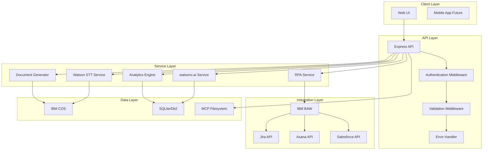
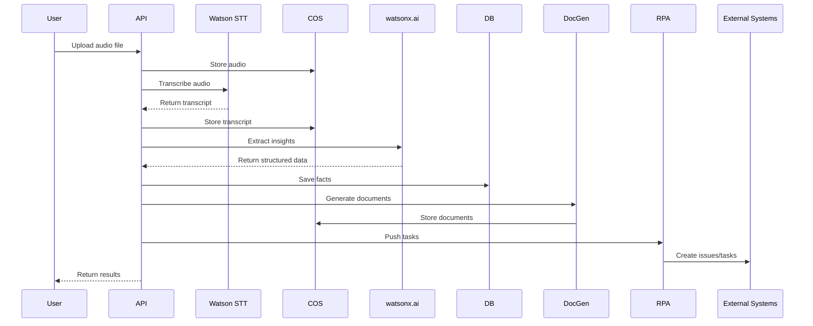

# Meeting Memory Intelligence Engine - Technical Specification

**Version:** 1.0  
**Date:** 2026-02-02  
**Status:** Planning Phase

---

## Table of Contents

1. [System Overview](#system-overview)
2. [Architecture](#architecture)
3. [API Specifications](#api-specifications)
4. [Database Schema](#database-schema)
5. [Service Integrations](#service-integrations)
6. [Security & Compliance](#security--compliance)
7. [Performance Requirements](#performance-requirements)
8. [Testing Strategy](#testing-strategy)

---

## System Overview

### Purpose
Automate the capture, processing, and documentation of client meetings to enable Customer Success Managers (CSMs) to focus on strategic work rather than manual note-taking and task tracking.

### Key Capabilities
1. **Audio Transcription** - Convert meeting audio to text with speaker identification
2. **Intelligent Extraction** - Identify actions, decisions, and risks using AI
3. **Document Generation** - Create professional meeting minutes and project plans
4. **Task Automation** - Push action items to project management systems
5. **Analytics** - Track trends and patterns across meetings
6. **Workflow Management** - Route tasks and track completion

### Technology Stack
- **Runtime:** Node.js 20+ with TypeScript
- **Framework:** Express.js
- **Database:** SQLite (MVP) → IBM Db2 (Production)
- **AI Services:** Watson Speech to Text, watsonx.ai
- **Storage:** IBM Cloud Object Storage (COS)
- **Automation:** IBM Business Automation Workflow, IBM RPA
- **Testing:** Jest, Supertest
- **Documentation:** MCP Filesystem

---

## Architecture

### High-Level Architecture



### Component Diagram

```mermaid
graph LR
    subgraph "API Routes"
        R1[/ingest]
        R2[/transcribe]
        R3[/process]
        R4[/insights]
        R5[/export]
        R6[/documents]
        R7[/workflows]
        R8[/analytics]
    end
    
    subgraph "Services"
        S1[COS Service]
        S2[STT Service]
        S3[watsonx.ai Service]
        S4[Document Service]
        S5[BAW Service]
        S6[RPA Service]
        S7[Analytics Service]
    end
    
    subgraph "Data Access"
        D1[Repository Layer]
        D2[Database]
    end
    
    R1 --> S1
    R2 --> S2
    R3 --> S3
    R4 --> D1
    R5 --> D1
    R6 --> S4
    R7 --> S5
    R8 --> S7
    
    S2 --> S1
    S3 --> D1
    S4 --> D1
    S5 --> S6
    S7 --> D1
    
    D1 --> D2
```

### Data Flow



---

## API Specifications

### Base URL
```
Development: http://localhost:8080
Production: https://meeting-intel.cloud.ibm.com
```

### Authentication
```
Header: Authorization: Bearer <token>
(Future implementation - currently open for MVP)
```

### Endpoints

#### 1. Upload Files
```http
POST /ingest
Content-Type: multipart/form-data

Request:
- files: File[] (max 10 files, max 100MB each)

Response:
{
  "ok": true,
  "files": [
    {
      "key": "uploads/1738478400000_meeting.mp3",
      "size": 5242880,
      "type": "audio/mpeg"
    }
  ]
}

Errors:
- 400: Invalid file type or size
- 413: Payload too large
- 500: Upload failed
```

#### 2. Transcribe Audio
```http
POST /transcribe
Content-Type: application/json

Request:
{
  "audioKey": "uploads/1738478400000_meeting.mp3",
  "language": "en-US",
  "speakerLabels": true,
  "maxSpeakers": 5
}

Response:
{
  "ok": true,
  "meetingId": 123,
  "transcript": {
    "text": "Full transcript text...",
    "speakers": [
      {
        "id": 1,
        "name": "Speaker 1",
        "confidence": 0.95
      }
    ],
    "segments": [
      {
        "speaker": 1,
        "text": "Let's discuss the project timeline.",
        "startTime": 0.0,
        "endTime": 3.5,
        "confidence": 0.98
      }
    ]
  }
}

Errors:
- 400: Invalid audio key or parameters
- 404: Audio file not found
- 500: Transcription failed
```

#### 3. Process Transcript
```http
POST /process
Content-Type: application/json

Request:
{
  "transcriptText": "Meeting transcript...",
  "meetingId": 123
}

Response:
{
  "ok": true,
  "facts": {
    "actions": [
      {
        "owner": "John Doe",
        "description": "Complete project proposal",
        "due_date": "2026-02-10",
        "confidence": 0.92
      }
    ],
    "decisions": [
      {
        "summary": "Approved budget increase",
        "rationale": "Required for additional resources",
        "date": "2026-02-02"
      }
    ],
    "risks": [
      {
        "summary": "Resource availability",
        "severity": "high",
        "owner_if_any": "Jane Smith"
      }
    ]
  }
}

Errors:
- 400: Missing transcript text
- 422: Extraction failed or invalid JSON
- 500: Processing error
```

#### 4. Get Insights
```http
GET /insights/timeline
GET /insights/owners
GET /insights/risks

Response (timeline):
{
  "decisions": [
    {
      "id": 1,
      "summary": "Approved budget increase",
      "rationale": "Required for additional resources",
      "date": "2026-02-02",
      "created_at": "2026-02-02T07:00:00Z"
    }
  ]
}

Response (owners):
{
  "owners": [
    {
      "owner": "John Doe",
      "cnt": 5
    }
  ]
}

Response (risks):
{
  "risks": [
    {
      "id": 1,
      "summary": "Resource availability",
      "severity": "high",
      "owner_if_any": "Jane Smith",
      "created_at": "2026-02-02T07:00:00Z"
    }
  ]
}
```

#### 5. Export Data
```http
GET /export/csv/actions
GET /export/json/facts

Response (CSV):
Content-Type: text/csv
owner,description,due_date,confidence,created_at
"John Doe","Complete project proposal","2026-02-10",0.92,"2026-02-02T07:00:00Z"

Response (JSON):
{
  "actions": [...],
  "decisions": [...],
  "risks": [...]
}
```

#### 6. Generate Documents
```http
POST /documents/generate
Content-Type: application/json

Request:
{
  "meetingId": 123,
  "type": "meeting-minutes",
  "format": "pdf"
}

Response:
{
  "ok": true,
  "documentKey": "documents/meeting-123-minutes.pdf",
  "downloadUrl": "https://cos.../documents/meeting-123-minutes.pdf"
}

Errors:
- 400: Invalid meeting ID or parameters
- 404: Meeting not found
- 500: Document generation failed
```

#### 7. Workflow Management
```http
POST /workflows/create
Content-Type: application/json

Request:
{
  "meetingId": 123,
  "workflowType": "task-assignment",
  "actions": [1, 2, 3]
}

Response:
{
  "ok": true,
  "workflowId": "wf-456",
  "status": "initiated"
}

GET /workflows/:id/status

Response:
{
  "workflowId": "wf-456",
  "status": "in-progress",
  "steps": [
    {
      "name": "Task Assignment",
      "status": "completed",
      "completedAt": "2026-02-02T07:05:00Z"
    },
    {
      "name": "Approval",
      "status": "pending",
      "assignee": "Manager"
    }
  ]
}
```

#### 8. Analytics
```http
GET /analytics/trends?startDate=2026-01-01&endDate=2026-02-02

Response:
{
  "period": {
    "start": "2026-01-01",
    "end": "2026-02-02"
  },
  "metrics": {
    "totalMeetings": 15,
    "totalActions": 45,
    "completedActions": 32,
    "completionRate": 0.71,
    "recurringRisks": [
      {
        "summary": "Resource availability",
        "occurrences": 5,
        "severity": "high"
      }
    ],
    "topOwners": [
      {
        "owner": "John Doe",
        "actionCount": 12,
        "completionRate": 0.83
      }
    ]
  }
}
```

---

## Database Schema

### SQLite Schema (MVP)

```sql
-- Meetings table
CREATE TABLE meetings (
  id INTEGER PRIMARY KEY AUTOINCREMENT,
  title TEXT NOT NULL,
  date TEXT NOT NULL,
  duration_minutes INTEGER,
  audio_key TEXT,
  transcript_key TEXT,
  status TEXT DEFAULT 'pending',
  created_at TEXT NOT NULL,
  updated_at TEXT
);

-- Speakers table
CREATE TABLE speakers (
  id INTEGER PRIMARY KEY AUTOINCREMENT,
  meeting_id INTEGER NOT NULL,
  name TEXT,
  label TEXT NOT NULL,
  confidence REAL,
  FOREIGN KEY(meeting_id) REFERENCES meetings(id) ON DELETE CASCADE
);

-- Transcripts table
CREATE TABLE transcripts (
  id INTEGER PRIMARY KEY AUTOINCREMENT,
  meeting_id INTEGER NOT NULL,
  speaker_id INTEGER,
  text TEXT NOT NULL,
  start_time REAL,
  end_time REAL,
  confidence REAL,
  FOREIGN KEY(meeting_id) REFERENCES meetings(id) ON DELETE CASCADE,
  FOREIGN KEY(speaker_id) REFERENCES speakers(id) ON DELETE SET NULL
);

-- Actions table (enhanced)
CREATE TABLE actions (
  id INTEGER PRIMARY KEY AUTOINCREMENT,
  meeting_id INTEGER,
  owner TEXT NOT NULL,
  description TEXT NOT NULL,
  due_date TEXT,
  confidence REAL,
  status TEXT DEFAULT 'pending',
  external_id TEXT,
  external_system TEXT,
  created_at TEXT NOT NULL,
  updated_at TEXT,
  FOREIGN KEY(meeting_id) REFERENCES meetings(id) ON DELETE SET NULL
);

-- Decisions table (enhanced)
CREATE TABLE decisions (
  id INTEGER PRIMARY KEY AUTOINCREMENT,
  meeting_id INTEGER,
  summary TEXT NOT NULL,
  rationale TEXT,
  date TEXT,
  impact TEXT,
  created_at TEXT NOT NULL,
  FOREIGN KEY(meeting_id) REFERENCES meetings(id) ON DELETE SET NULL
);

-- Risks table (enhanced)
CREATE TABLE risks (
  id INTEGER PRIMARY KEY AUTOINCREMENT,
  meeting_id INTEGER,
  summary TEXT NOT NULL,
  severity TEXT NOT NULL CHECK(severity IN ('low', 'med', 'high')),
  owner_if_any TEXT,
  mitigation TEXT,
  status TEXT DEFAULT 'open',
  created_at TEXT NOT NULL,
  updated_at TEXT,
  FOREIGN KEY(meeting_id) REFERENCES meetings(id) ON DELETE SET NULL
);

-- Workflows table
CREATE TABLE workflows (
  id TEXT PRIMARY KEY,
  meeting_id INTEGER NOT NULL,
  type TEXT NOT NULL,
  status TEXT NOT NULL,
  created_at TEXT NOT NULL,
  updated_at TEXT,
  FOREIGN KEY(meeting_id) REFERENCES meetings(id) ON DELETE CASCADE
);

-- Workflow steps table
CREATE TABLE workflow_steps (
  id INTEGER PRIMARY KEY AUTOINCREMENT,
  workflow_id TEXT NOT NULL,
  name TEXT NOT NULL,
  status TEXT NOT NULL,
  assignee TEXT,
  completed_at TEXT,
  FOREIGN KEY(workflow_id) REFERENCES workflows(id) ON DELETE CASCADE
);

-- Indexes for performance
CREATE INDEX idx_actions_owner ON actions(owner);
CREATE INDEX idx_actions_status ON actions(status);
CREATE INDEX idx_actions_meeting ON actions(meeting_id);
CREATE INDEX idx_decisions_date ON decisions(date);
CREATE INDEX idx_risks_severity ON risks(severity);
CREATE INDEX idx_risks_status ON risks(status);
CREATE INDEX idx_meetings_date ON meetings(date);
CREATE INDEX idx_transcripts_meeting ON transcripts(meeting_id);
```

### Migration Strategy

```typescript
// api/src/db/migrations.ts
export const migrations = [
  {
    version: 1,
    up: (db: Database) => {
      // Initial schema
      db.exec(`CREATE TABLE meetings (...)`);
    }
  },
  {
    version: 2,
    up: (db: Database) => {
      // Add workflow tables
      db.exec(`CREATE TABLE workflows (...)`);
    }
  }
];
```

---

## Service Integrations

### Watson Speech to Text

**Configuration:**
```typescript
// api/src/services/stt.ts
import SpeechToTextV1 from 'ibm-watson/speech-to-text/v1';
import { IamAuthenticator } from 'ibm-watson/auth';

const speechToText = new SpeechToTextV1({
  authenticator: new IamAuthenticator({
    apikey: process.env.WATSON_STT_APIKEY!,
  }),
  serviceUrl: process.env.WATSON_STT_URL!,
});

export async function transcribeAudio(
  audioBuffer: Buffer,
  options: {
    contentType: string;
    speakerLabels?: boolean;
    maxSpeakers?: number;
    language?: string;
  }
) {
  const params = {
    audio: audioBuffer,
    contentType: options.contentType,
    model: `${options.language || 'en-US'}_BroadbandModel`,
    speakerLabels: options.speakerLabels || false,
    maxAlternatives: 1,
    timestamps: true,
    wordConfidence: true,
  };

  const response = await speechToText.recognize(params);
  return parseTranscriptResponse(response.result);
}
```

**Supported Audio Formats:**
- WAV (audio/wav)
- MP3 (audio/mpeg)
- FLAC (audio/flac)
- OGG (audio/ogg)
- WebM (audio/webm)

**Rate Limits:**
- Lite plan: 500 minutes/month
- Standard plan: Pay-as-you-go

### watsonx.ai

**Configuration:**
```typescript
// api/src/services/wx.ts
import { WatsonXAI } from '@ibm-cloud/watsonx-ai';

const wx = WatsonXAI.newInstance({
  version: process.env.WATSONX_API_VERSION!,
  serviceUrl: process.env.WATSONX_AI_SERVICE_URL!,
});

export async function extractFacts(
  transcript: string,
  prompt: string
) {
  const response = await wx.textGeneration({
    input: `${prompt}\n\nFULL TRANSCRIPT:\n${transcript}`,
    modelId: process.env.WATSONX_MODEL_ID!,
    projectId: process.env.WATSONX_AI_PROJECT_ID!,
    parameters: {
      max_new_tokens: 800,
      temperature: 0.2,
      top_p: 0.95,
      repetition_penalty: 1.1,
    },
  });

  return response.result;
}
```

**Model Selection:**
- Primary: `ibm/granite-3-8b-instruct`
- Fallback: `ibm/granite-13b-chat-v2`

### IBM Cloud Object Storage

**Configuration:**
```typescript
// api/src/services/cos.ts
import IBM from 'ibm-cos-sdk';

const cos = new IBM.S3({
  endpoint: process.env.COS_ENDPOINT!,
  apiKeyId: process.env.COS_API_KEY_ID!,
  serviceInstanceId: process.env.COS_INSTANCE_CRN!,
  signatureVersion: 'iam',
});

export async function uploadFile(
  key: string,
  body: Buffer,
  metadata?: Record<string, string>
) {
  await cos.putObject({
    Bucket: process.env.COS_BUCKET!,
    Key: key,
    Body: body,
    Metadata: metadata,
  }).promise();
}

export async function downloadFile(key: string) {
  const response = await cos.getObject({
    Bucket: process.env.COS_BUCKET!,
    Key: key,
  }).promise();
  
  return response.Body as Buffer;
}
```

**Bucket Structure:**
```
meeting-intel-uploads/
├── audio/
│   └── YYYY-MM-DD/
│       └── {timestamp}_{filename}
├── transcripts/
│   └── YYYY-MM-DD/
│       └── {meeting_id}.txt
└── documents/
    └── YYYY-MM-DD/
        ├── {meeting_id}_minutes.pdf
        └── {meeting_id}_plan.docx
```

### IBM Business Automation Workflow

**Integration Approach:**
```typescript
// api/src/services/baw.ts
import axios from 'axios';

export async function createWorkflow(
  workflowType: string,
  data: any
) {
  const response = await axios.post(
    `${process.env.BAW_URL}/rest/bpm/wle/v1/process`,
    {
      processAppName: 'MeetingIntelligence',
      processName: workflowType,
      params: data,
    },
    {
      headers: {
        'Authorization': `Bearer ${await getBawToken()}`,
        'Content-Type': 'application/json',
      },
    }
  );

  return response.data;
}
```

**Workflow Types:**
1. Task Assignment Workflow
2. Document Review Workflow
3. Risk Escalation Workflow

### IBM RPA

**Integration Approach:**
```typescript
// api/src/services/rpa.ts
export async function pushToExternalSystem(
  system: 'jira' | 'asana' | 'salesforce',
  action: Action
) {
  const bot = await getRpaBot(system);
  
  const result = await bot.execute({
    action: 'create_task',
    data: {
      title: action.description,
      assignee: action.owner,
      dueDate: action.due_date,
      priority: calculatePriority(action.confidence),
    },
  });

  return result;
}
```

**Supported Systems:**
- Jira (REST API v3)
- Asana (REST API v1)
- Salesforce (REST API v52.0)

---

## Security & Compliance

### Authentication & Authorization
```typescript
// api/src/middleware/auth.ts
export function authenticate(req, res, next) {
  // Future: JWT validation
  // For MVP: Open access
  next();
}

export function authorize(roles: string[]) {
  return (req, res, next) => {
    // Future: Role-based access control
    next();
  };
}
```

### Data Protection
- All credentials in `.env` file (never committed)
- Secrets encrypted at rest in COS
- TLS 1.3 for all API communications
- Input sanitization and validation
- SQL injection prevention (parameterized queries)
- XSS protection (Content Security Policy)

### Compliance
- GDPR: Data retention policies, right to deletion
- SOC 2: Audit logging, access controls
- HIPAA: PHI handling (if applicable)

### Error Handling
```typescript
// api/src/middleware/errorHandler.ts
export function errorHandler(err, req, res, next) {
  logger.error({
    error: err.message,
    stack: process.env.NODE_ENV === 'development' ? err.stack : undefined,
    path: req.path,
    method: req.method,
  });

  // Never expose stack traces to users
  res.status(err.statusCode || 500).json({
    error: err.message || 'Internal server error',
    code: err.code || 'INTERNAL_ERROR',
  });
}
```

---

## Performance Requirements

### Response Time Targets
- API endpoints: < 2 seconds (excluding AI processing)
- Audio transcription: < 30 seconds per 10 minutes of audio
- Fact extraction: < 10 seconds per transcript
- Document generation: < 5 seconds
- Database queries: < 100ms

### Scalability
- Support 100 concurrent users
- Process 1000 meetings per day
- Store 10TB of audio files
- Handle 10,000 API requests per hour

### Optimization Strategies
1. **Caching**
   - Redis for frequently accessed data
   - CDN for static assets
   - Browser caching for UI

2. **Database**
   - Indexes on frequently queried columns
   - Connection pooling
   - Query optimization

3. **API**
   - Request rate limiting
   - Response compression
   - Async processing for long-running tasks

4. **Storage**
   - Multipart uploads for large files
   - Lifecycle policies for old data
   - Compression for text files

---

## Testing Strategy

### Unit Tests (70% coverage target)
```typescript
// api/test/services/stt.test.ts
describe('STT Service', () => {
  it('should transcribe audio file', async () => {
    const buffer = fs.readFileSync('test/fixtures/sample.wav');
    const result = await transcribeAudio(buffer, {
      contentType: 'audio/wav',
      language: 'en-US',
    });
    
    expect(result.text).toBeDefined();
    expect(result.confidence).toBeGreaterThan(0.8);
  });
});
```

### Integration Tests
```typescript
// api/test/integration/workflow.test.ts
describe('End-to-End Workflow', () => {
  it('should process audio to tasks', async () => {
    // Upload audio
    const uploadRes = await request(app)
      .post('/ingest')
      .attach('files', 'test/fixtures/meeting.mp3');
    
    // Transcribe
    const transcribeRes = await request(app)
      .post('/transcribe')
      .send({ audioKey: uploadRes.body.files[0].key });
    
    // Process
    const processRes = await request(app)
      .post('/process')
      .send({ transcriptText: transcribeRes.body.transcript.text });
    
    expect(processRes.body.facts.actions).toHaveLength(3);
  });
});
```

### Load Testing
```bash
# Using Apache Bench
ab -n 1000 -c 10 http://localhost:8080/health

# Using k6
k6 run test/load/api-load.js
```

### Manual Testing Checklist
- [ ] Audio upload and transcription
- [ ] Speaker identification accuracy
- [ ] Fact extraction accuracy
- [ ] Document generation quality
- [ ] External system integration
- [ ] Error handling and recovery
- [ ] UI responsiveness
- [ ] Mobile compatibility

---

## Deployment

### Environment Variables
```bash
# IBM Watson Speech to Text
WATSON_STT_APIKEY=
WATSON_STT_URL=
WATSON_STT_INSTANCE_ID=

# IBM watsonx.ai
WATSONX_AI_AUTH_TYPE=iam
WATSONX_AI_APIKEY=
WATSONX_AI_SERVICE_URL=
WATSONX_AI_PROJECT_ID=
WATSONX_MODEL_ID=ibm/granite-3-8b-instruct
WATSONX_API_VERSION=2025-02-11

# IBM Cloud Object Storage
COS_ENDPOINT=
COS_API_KEY_ID=
COS_INSTANCE_CRN=
COS_BUCKET=

# IBM Business Automation Workflow
BAW_URL=
BAW_CLIENT_ID=
BAW_CLIENT_SECRET=

# IBM RPA
RPA_API_URL=
RPA_API_KEY=

# External Systems
JIRA_URL=
JIRA_API_TOKEN=
ASANA_API_TOKEN=
SALESFORCE_INSTANCE_URL=
SALESFORCE_ACCESS_TOKEN=

# Application
PORT=8080
NODE_ENV=production
LOG_LEVEL=info
```

### Docker Deployment
```dockerfile
FROM node:20-alpine
WORKDIR /app
COPY api/package*.json ./
RUN npm ci --only=production
COPY api/dist ./dist
EXPOSE 8080
CMD ["node", "dist/index.js"]
```

### IBM Cloud Code Engine
```yaml
apiVersion: serving.knative.dev/v1
kind: Service
metadata:
  name: meeting-intel-api
spec:
  template:
    spec:
      containers:
      - image: icr.io/namespace/meeting-intel:latest
        env:
        - name: WATSON_STT_APIKEY
          valueFrom:
            secretKeyRef:
              name: watson-credentials
              key: stt-apikey
        resources:
          limits:
            memory: 2Gi
            cpu: 1000m
```

---

**Document Status:** Complete  
**Next Review:** After Phase 1 Implementation  
**Approval Required:** Technical Lead