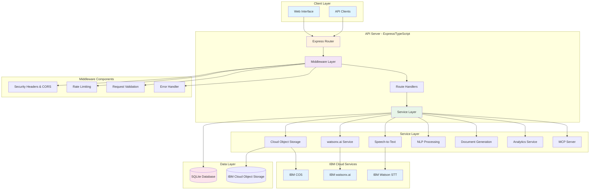
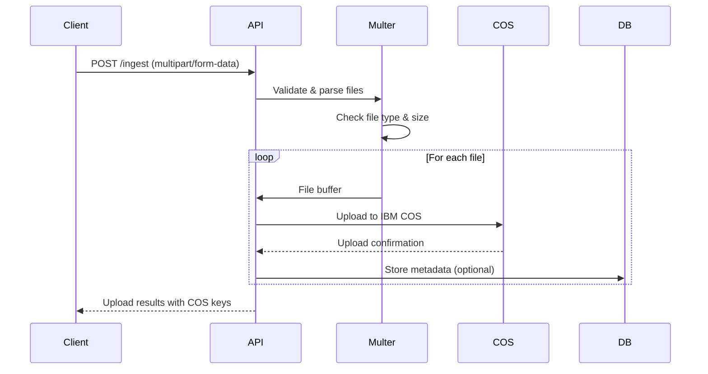
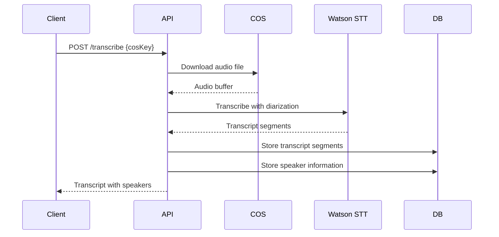
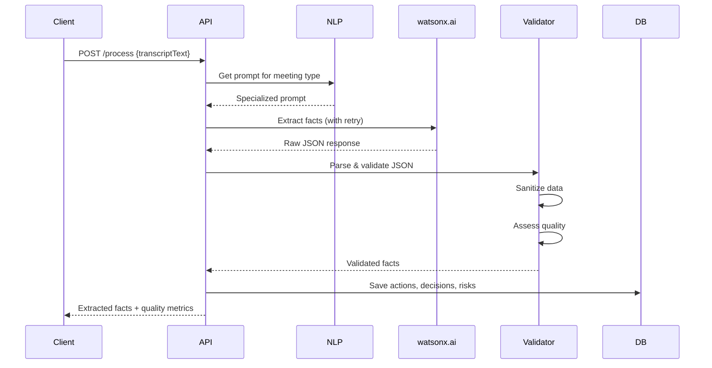
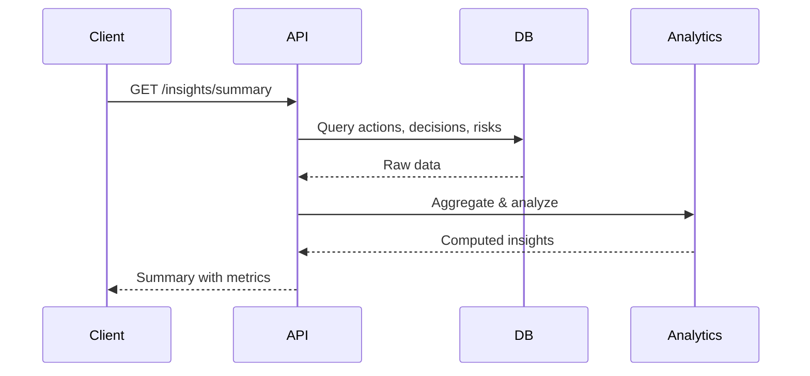
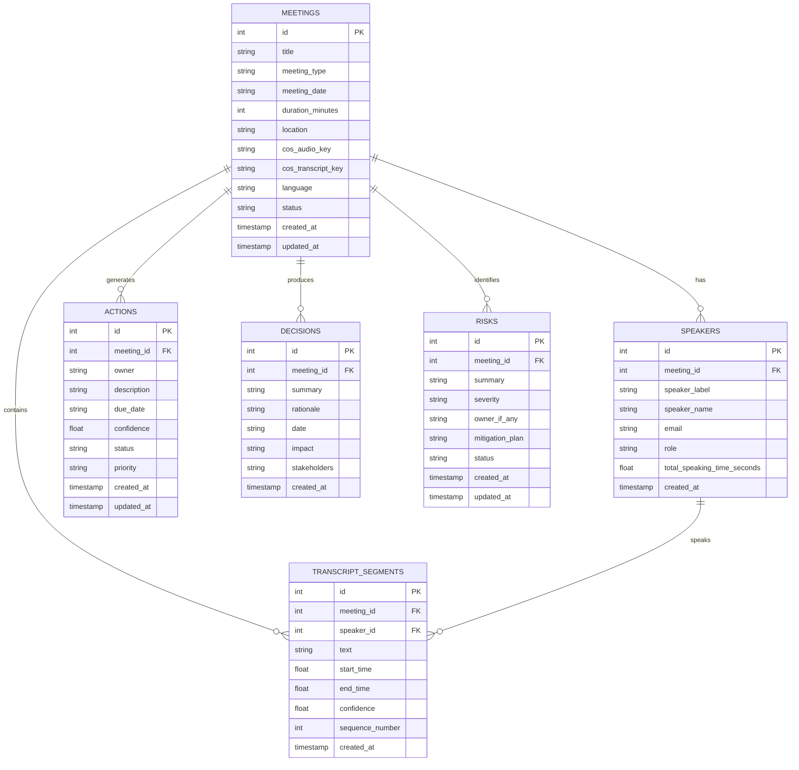

# Meeting Memory Intelligence Engine - Architecture

## Table of Contents
- [Overview](#overview)
- [High-Level Architecture](#high-level-architecture)
- [System Components](#system-components)
- [Data Flow](#data-flow)
- [Technology Stack](#technology-stack)
- [IBM Cloud Services Integration](#ibm-cloud-services-integration)
- [Database Schema](#database-schema)
- [Security Architecture](#security-architecture)

## Overview

The Meeting Memory Intelligence Engine is a sophisticated system that transforms mixed meeting artifacts (audio recordings, transcripts, slides, notes, chat logs) into actionable intelligence. The system extracts structured information including action items, decisions, risks, and provides cross-meeting analytics.

### Key Capabilities
- **Multi-format Ingestion**: Supports audio (MP3, WAV, M4A), documents (PDF, DOCX), and text files
- **AI-Powered Extraction**: Uses IBM watsonx.ai for intelligent fact extraction
- **Structured Storage**: SQLite database with comprehensive schema for meetings, transcripts, and extracted facts
- **Analytics & Insights**: Cross-meeting timeline, owner workload analysis, risk tracking
- **Export Capabilities**: CSV and JSON exports for integration with external systems
- **MCP Integration**: Model Context Protocol support for agentic workflows

## High-Level Architecture



## System Components

### 1. API Server (`api/src/index.ts`)

The core Express.js application that orchestrates all system functionality.

**Key Features:**
- RESTful API endpoints for all operations
- Middleware pipeline for security, validation, and error handling
- Graceful shutdown handling
- Comprehensive logging with Pino
- Health check endpoint

**Port:** 8080 (configurable via `PORT` environment variable)

### 2. Route Handlers

#### `/ingest` - File Upload
- **Purpose**: Upload meeting artifacts to IBM Cloud Object Storage
- **Supported Formats**: Audio (MP3, WAV, M4A), Documents (PDF, DOCX), Text (TXT, MD)
- **Max File Size**: 100MB per file
- **Max Files**: 10 files per request
- **Implementation**: `api/src/routes/ingest.ts`

#### `/transcribe` - Audio Transcription
- **Purpose**: Convert audio files to text using IBM Watson Speech-to-Text
- **Features**: Speaker diarization, confidence scores, timestamps
- **Implementation**: `api/src/routes/transcribe.ts`

#### `/process` - Fact Extraction
- **Purpose**: Extract structured facts from meeting transcripts
- **AI Model**: IBM watsonx.ai (Granite 3 8B Instruct)
- **Extracts**: Actions, Decisions, Risks
- **Implementation**: `api/src/routes/process.ts`

#### `/insights` - Analytics
- **Endpoints**:
  - `GET /insights/timeline` - Chronological decision timeline
  - `GET /insights/owners` - Action items by owner
  - `GET /insights/risks` - Risk analysis
  - `GET /insights/summary` - Overall statistics
- **Implementation**: `api/src/routes/insights.ts`

#### `/export` - Data Export
- **Formats**: CSV, JSON
- **Endpoints**:
  - `GET /export/csv/actions`
  - `GET /export/csv/decisions`
  - `GET /export/csv/risks`
  - `GET /export/json/facts`
- **Implementation**: `api/src/routes/export.ts`

#### `/meetings` - Meeting Management
- **Operations**: CRUD operations for meetings
- **Features**: Meeting metadata, speakers, transcripts, statistics
- **Implementation**: `api/src/routes/meetings.ts`

#### `/documents` - Document Generation
- **Purpose**: Generate formatted documents from meeting data
- **Implementation**: `api/src/routes/documents.ts`

#### `/analytics` - Advanced Analytics
- **Purpose**: Complex analytics and reporting
- **Implementation**: `api/src/routes/analytics.ts`

#### `/mcp` - MCP Integration
- **Purpose**: Model Context Protocol server integration
- **Features**: Agentic exports, tool usage tracking
- **Implementation**: `api/src/routes/mcp.ts`

### 3. Middleware Layer

#### Security Middleware (`api/src/middleware/security.ts`)
- **Security Headers**: CSP, X-Frame-Options, HSTS, X-Content-Type-Options
- **CORS**: Configurable cross-origin resource sharing
- **Request Sanitization**: XSS protection, input sanitization
- **Request ID**: Unique identifier for request tracking

#### Rate Limiting (`api/src/middleware/rateLimiter.ts`)
Three-tier rate limiting strategy:
- **General API**: 100 requests per 15 minutes
- **Upload Operations**: 20 requests per 15 minutes
- **Expensive Operations**: 10 requests per 15 minutes

#### Validation Middleware (`api/src/middleware/validator.ts`)
- **Schema Validation**: Zod-based request validation
- **Type Safety**: TypeScript type checking
- **Error Messages**: Detailed validation error responses

#### Error Handler (`api/src/middleware/errorHandler.ts`)
- **Global Error Handling**: Catches all unhandled errors
- **Structured Responses**: Consistent error format
- **Logging**: Comprehensive error logging
- **Process Handlers**: Uncaught exception and unhandled rejection handling

### 4. Service Layer

#### Cloud Object Storage Service (`api/src/services/cos.ts`)
```typescript
// Key Functions
uploadObject(key, body, contentType)    // Upload files
downloadObject(key)                      // Download files
listObjects(prefix)                      // List files
deleteObject(key)                        // Delete files
```

**Integration**: IBM Cloud Object Storage (S3-compatible)

#### watsonx.ai Service (`api/src/services/wx.ts`)
```typescript
// Key Functions
wxExtractText(input, systemPrompt, options)           // Extract with retry logic
wxExtractWithFallback(input, primary, fallback)       // Fallback strategy
testWatsonXConnection()                               // Connection test
```

**Features**:
- Exponential backoff retry logic (up to 3 attempts)
- Fallback prompt strategy
- Configurable parameters (temperature, max tokens, top-p)
- Error handling for auth, quota, and rate limit issues

#### NLP Service (`api/src/services/nlp.ts`)
**Prompts**:
- `FACTS_PROMPT_V1`: Baseline extraction prompt
- `FACTS_PROMPT_V2`: Enhanced prompt with strict JSON enforcement
- `MEETING_TYPE_PROMPTS`: Specialized prompts for different meeting types (standup, planning, retrospective, client)

**Meeting Type Support**:
- **Standup**: Focus on action items, blockers, quick decisions
- **Planning**: Emphasis on goals, milestones, resource allocation
- **Retrospective**: What went well, what to improve, action items
- **Client**: Decisions, commitments, next steps, risks

#### Speech-to-Text Service (`api/src/services/stt.ts`)
- **Provider**: IBM Watson Speech-to-Text
- **Features**: Speaker diarization, confidence scores, timestamps
- **Status**: Coming soon (placeholder implementation)

#### Document Generation Service (`api/src/services/docgen.ts`)
- **Purpose**: Generate formatted reports and documents
- **Formats**: Markdown, HTML, PDF (planned)

#### Analytics Service (`api/src/services/analytics.ts`)
- **Capabilities**: Trend analysis, workload distribution, risk assessment
- **Metrics**: Action completion rates, decision impact, risk severity distribution

#### MCP Service (`api/src/services/mcp.ts`)
- **Purpose**: Model Context Protocol integration
- **Features**: Filesystem server integration, tool usage tracking
- **Directory**: `./exports` for generated files

### 5. Database Layer (`api/src/db/repo.ts`)

**Database**: SQLite (better-sqlite3)
**Location**: `api/data/meeting.db`

**Key Functions**:
```typescript
// Initialization
init()                                    // Initialize database and schema

// Meetings
createMeeting(meeting)                    // Create new meeting
getMeeting(id)                            // Get meeting by ID
getAllMeetings(limit, offset)             // List meetings with pagination
updateMeeting(id, updates)                // Update meeting
deleteMeeting(id)                         // Delete meeting (cascades)
getMeetingStats(id)                       // Get meeting statistics

// Speakers
createSpeaker(speaker)                    // Add speaker to meeting
getSpeakersByMeeting(meetingId)           // Get all speakers for meeting

// Transcripts
createTranscriptSegment(segment)          // Add transcript segment
getTranscriptByMeeting(meetingId)         // Get all segments
getFullTranscriptText(meetingId)          // Get concatenated text

// Facts
saveFacts(facts)                          // Save extracted facts (actions, decisions, risks)
```

## Data Flow

### 1. Meeting Artifact Ingestion Flow



### 2. Audio Transcription Flow



### 3. Fact Extraction Flow



### 4. Insights Generation Flow



## Technology Stack

### Backend
- **Runtime**: Node.js 20+
- **Framework**: Express.js 4.19+
- **Language**: TypeScript 5.6+
- **Database**: SQLite (better-sqlite3)
- **Validation**: Zod 3.23+
- **Logging**: Pino 9.2+

### IBM Cloud Services
- **watsonx.ai**: AI/ML model for fact extraction (Granite 3 8B Instruct)
- **Cloud Object Storage**: S3-compatible object storage for artifacts
- **Watson Speech-to-Text**: Audio transcription with speaker diarization

### Development Tools
- **Build**: TypeScript Compiler (tsc)
- **Dev Server**: tsx watch mode
- **Testing**: Jest 29+ with ts-jest
- **Linting**: TypeScript ESLint (implicit)

### Dependencies
```json
{
  "@ibm-cloud/watsonx-ai": "^1.7.1",
  "better-sqlite3": "^11.7.0",
  "cors": "^2.8.5",
  "dotenv": "^16.4.5",
  "express": "^4.19.2",
  "ibm-cos-sdk": "^1.14.2",
  "ibm-watson": "^9.1.0",
  "multer": "^1.4.5-lts.1",
  "pino": "^9.2.0",
  "zod": "^3.23.8"
}
```

## IBM Cloud Services Integration

### 1. IBM Cloud Object Storage (COS)

**Purpose**: Store raw meeting artifacts (audio, documents, transcripts)

**Configuration**:
```typescript
const cos = new IBM.S3({
  endpoint: process.env.COS_ENDPOINT,
  apiKeyId: process.env.COS_API_KEY_ID,
  serviceInstanceId: process.env.COS_INSTANCE_CRN,
  signatureVersion: 'iam'
});
```

**Required Environment Variables**:
- `COS_ENDPOINT`: Regional endpoint (e.g., `https://s3.us-south.cloud-object-storage.appdomain.cloud`)
- `COS_API_KEY_ID`: IBM Cloud API key
- `COS_INSTANCE_CRN`: COS instance resource ID
- `COS_BUCKET`: Bucket name for uploads

**Operations**:
- Upload: `putObject()` with automatic key generation
- Download: `getObject()` for processing
- List: `listObjectsV2()` for inventory
- Delete: `deleteObject()` for cleanup

### 2. IBM watsonx.ai

**Purpose**: AI-powered fact extraction from meeting transcripts

**Configuration**:
```typescript
const wx = WatsonXAI.newInstance({
  version: process.env.WATSONX_API_VERSION,
  serviceUrl: process.env.WATSONX_AI_SERVICE_URL
});
```

**Required Environment Variables**:
- `WATSONX_AI_AUTH_TYPE`: Authentication type (iam)
- `WATSONX_AI_APIKEY`: watsonx.ai API key
- `WATSONX_AI_SERVICE_URL`: Regional service URL
- `WATSONX_AI_PROJECT_ID`: Project ID
- `WATSONX_MODEL_ID`: Model identifier (default: `ibm/granite-3-8b-instruct`)
- `WATSONX_API_VERSION`: API version (e.g., `2025-02-11`)

**Model Parameters**:
- `max_new_tokens`: 800 (configurable)
- `temperature`: 0.2 (low for consistent extraction)
- `top_p`: 0.95
- `repetition_penalty`: 1.1
- `stop_sequences`: ['\n\n\n']

**Error Handling**:
- Automatic retry with exponential backoff (3 attempts)
- Fallback prompt strategy for failed extractions
- Specific handling for auth, quota, and rate limit errors

### 3. IBM Watson Speech-to-Text

**Purpose**: Convert audio recordings to text with speaker identification

**Status**: Coming soon (placeholder implementation ready)

**Planned Features**:
- Speaker diarization (identify different speakers)
- Confidence scores per word/segment
- Timestamp information
- Multiple language support

## Database Schema

### Tables

#### `meetings`
```sql
CREATE TABLE meetings (
  id INTEGER PRIMARY KEY AUTOINCREMENT,
  title TEXT NOT NULL,
  meeting_type TEXT CHECK(meeting_type IN ('standup','planning','retrospective','client','other')),
  meeting_date TEXT NOT NULL,
  duration_minutes INTEGER,
  location TEXT,
  cos_audio_key TEXT,
  cos_transcript_key TEXT,
  language TEXT DEFAULT 'en-US',
  status TEXT CHECK(status IN ('scheduled','in_progress','completed','cancelled')),
  created_at TEXT DEFAULT CURRENT_TIMESTAMP,
  updated_at TEXT DEFAULT CURRENT_TIMESTAMP
);
```

#### `speakers`
```sql
CREATE TABLE speakers (
  id INTEGER PRIMARY KEY AUTOINCREMENT,
  meeting_id INTEGER NOT NULL,
  speaker_label TEXT NOT NULL,
  speaker_name TEXT,
  email TEXT,
  role TEXT,
  total_speaking_time_seconds REAL,
  created_at TEXT DEFAULT CURRENT_TIMESTAMP,
  FOREIGN KEY (meeting_id) REFERENCES meetings(id) ON DELETE CASCADE
);
```

#### `transcript_segments`
```sql
CREATE TABLE transcript_segments (
  id INTEGER PRIMARY KEY AUTOINCREMENT,
  meeting_id INTEGER NOT NULL,
  speaker_id INTEGER,
  text TEXT NOT NULL,
  start_time REAL NOT NULL,
  end_time REAL NOT NULL,
  confidence REAL,
  sequence_number INTEGER NOT NULL,
  created_at TEXT DEFAULT CURRENT_TIMESTAMP,
  FOREIGN KEY (meeting_id) REFERENCES meetings(id) ON DELETE CASCADE,
  FOREIGN KEY (speaker_id) REFERENCES speakers(id) ON DELETE SET NULL
);
```

#### `actions`
```sql
CREATE TABLE actions (
  id INTEGER PRIMARY KEY AUTOINCREMENT,
  meeting_id INTEGER,
  owner TEXT NOT NULL,
  description TEXT NOT NULL,
  due_date TEXT,
  confidence REAL,
  status TEXT DEFAULT 'pending' CHECK(status IN ('pending','in_progress','completed','cancelled')),
  priority TEXT CHECK(priority IN ('low','medium','high','critical')),
  created_at TEXT DEFAULT CURRENT_TIMESTAMP,
  updated_at TEXT DEFAULT CURRENT_TIMESTAMP,
  FOREIGN KEY (meeting_id) REFERENCES meetings(id) ON DELETE SET NULL
);
```

#### `decisions`
```sql
CREATE TABLE decisions (
  id INTEGER PRIMARY KEY AUTOINCREMENT,
  meeting_id INTEGER,
  summary TEXT NOT NULL,
  rationale TEXT,
  date TEXT,
  impact TEXT CHECK(impact IN ('low','medium','high')),
  stakeholders TEXT,
  created_at TEXT DEFAULT CURRENT_TIMESTAMP,
  FOREIGN KEY (meeting_id) REFERENCES meetings(id) ON DELETE SET NULL
);
```

#### `risks`
```sql
CREATE TABLE risks (
  id INTEGER PRIMARY KEY AUTOINCREMENT,
  meeting_id INTEGER,
  summary TEXT NOT NULL,
  severity TEXT NOT NULL CHECK(severity IN ('low','med','high','critical')),
  owner_if_any TEXT,
  mitigation_plan TEXT,
  status TEXT DEFAULT 'identified' CHECK(status IN ('identified','mitigating','resolved','accepted')),
  created_at TEXT DEFAULT CURRENT_TIMESTAMP,
  updated_at TEXT DEFAULT CURRENT_TIMESTAMP,
  FOREIGN KEY (meeting_id) REFERENCES meetings(id) ON DELETE SET NULL
);
```

### Relationships



## Security Architecture

### 1. Security Headers

Implemented via `applySecurity()` middleware:

```typescript
{
  headers: {
    contentSecurityPolicy: true,
    frameOptions: 'SAMEORIGIN',
    hsts: {
      maxAge: 31536000,
      includeSubDomains: true
    }
  }
}
```

**Headers Applied**:
- `Content-Security-Policy`: Prevents XSS attacks
- `X-Frame-Options`: Prevents clickjacking
- `X-Content-Type-Options: nosniff`: Prevents MIME sniffing
- `X-XSS-Protection`: Browser XSS protection
- `Strict-Transport-Security`: Forces HTTPS
- `Referrer-Policy`: Controls referrer information

### 2. CORS Configuration

```typescript
{
  cors: {
    origin: process.env.CORS_ORIGIN || '*',
    credentials: true,
    methods: ['GET', 'POST', 'PUT', 'DELETE', 'PATCH', 'OPTIONS']
  }
}
```

### 3. Input Sanitization

- **Request Body**: Sanitizes HTML and script tags
- **Query Parameters**: Validates and sanitizes
- **File Uploads**: Type and size validation via Multer

### 4. Rate Limiting

Three-tier strategy prevents abuse:
- **General API**: 100 req/15min per IP
- **Upload**: 20 req/15min per IP
- **Expensive Ops**: 10 req/15min per IP

### 5. Error Handling

- **No Stack Traces**: Production mode hides internal errors
- **Sanitized Messages**: User-friendly error messages
- **Logging**: Comprehensive error logging for debugging
- **Request IDs**: Unique identifiers for request tracking

### 6. Environment Variables

- **Secrets Management**: All credentials via environment variables
- **No Hardcoding**: No sensitive data in code
- **Validation**: Required variables checked at startup

### 7. File Upload Security

- **Type Validation**: Whitelist of allowed MIME types
- **Size Limits**: 100MB per file, 10 files per request
- **Sanitized Names**: Special characters removed from filenames
- **Virus Scanning**: Recommended for production (not implemented)

## Performance Considerations

### 1. Database Optimization
- **Indexes**: Automatic on primary and foreign keys
- **Connection Pooling**: Single connection (SQLite limitation)
- **Prepared Statements**: All queries use prepared statements

### 2. Caching Strategy
- **In-Memory**: Not implemented (future enhancement)
- **CDN**: Recommended for static assets in production

### 3. Async Operations
- **Non-Blocking**: All I/O operations are async
- **Concurrent Processing**: Multiple files processed in parallel
- **Streaming**: Large files handled via streams where possible

### 4. Resource Limits
- **Body Size**: 20MB JSON/form data
- **File Size**: 100MB per file
- **Concurrent Requests**: Limited by rate limiting

## Scalability

### Horizontal Scaling
- **Stateless Design**: No session state in application
- **Load Balancer Ready**: Can run multiple instances
- **Shared Database**: SQLite limits horizontal scaling (consider PostgreSQL/Db2 for production)

### Vertical Scaling
- **CPU**: Handles concurrent requests efficiently
- **Memory**: Moderate memory footprint
- **Storage**: Grows with meeting data and artifacts

### Future Enhancements
- **Database Migration**: SQLite → PostgreSQL/IBM Db2
- **Caching Layer**: Redis for frequently accessed data
- **Message Queue**: For async processing of large files
- **Microservices**: Split into specialized services

## Monitoring & Observability

### Logging
- **Library**: Pino (high-performance JSON logger)
- **Levels**: error, warn, info, debug, trace
- **Structured**: JSON format for easy parsing
- **Request Tracking**: Unique request IDs

### Health Checks
- **Endpoint**: `GET /health`
- **Response**: System status, timestamp, version

### Metrics (Recommended)
- Request rate and latency
- Error rates by endpoint
- Database query performance
- External service response times
- Rate limit hits

### Error Tracking (Recommended)
- Sentry or similar service
- Automatic error reporting
- Stack trace capture
- User context

---

**Last Updated**: 2026-02-03  
**Version**: 0.1.0  
**Maintainer**: Development Team